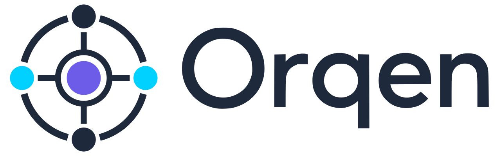

<br>
<div align="center">
    
    <p align="center">
        Execution layer for AI workflows
    </p>

[](https://go.dev/)
[](https://pkg.go.dev/github.com/nidorx/orqen)
[](LICENSE)

</div>

---

Oi 🙂 Orqen é o sistema que organiza seu trabalho com IA de forma estruturada. Ele transforma processos repetitivos em pipelines claros, com memória persistente e execução determinística.

## O Que é Orqen?

Orqen é um motor de orquestração de workflows open-source. Inspirado no Kanban, ele serve não apenas ao desenvolvimento de software, mas **qualquer fluxo** que você queira automatizar — criação de conteúdo, marketing, operações e além.

**Diferencial principal:** Orqen funciona com **qualquer agente que use o Agent Client Protocol (ACP)**, dando a você liberdade para escolher provedores de IA.

### Casos de Uso

- **Desenvolvimento de Software** — Fluxos estilo Scrum (backlog, implementação, revisão, retrospectiva)
- **Criação de Conteúdo** — Ideação → roteiro → revisão → publicação
- **Pipelines de Marketing** — Planejamento de campanhas, fluxos de aprovação, testes A/B
- **Qualquer Processo Repetitivo** — Se você faz repetidamente, Orqen estrutura

## O Problema

Ferramentas de IA hoje operam como **máquinas de prompt sem estado**. Você precisa iterar manualmente, manter contexto na cabeça e gerenciar decisões entre conversas. Não existe um sistema estruturado para execução determinística, memória persistente ou orquestração multi-projeto.

## A Solução

Orqen fornece uma **camada de execução estruturada** que:

1. **Orquestra agentes de IA** através de fluxos definidos (lanes)
2. **Persiste estado** via design filesystem-first (tarefas, decisões, aprendizados)
3. **Suporta múltiplos projetos** com configurações independentes
4. **Funciona com qualquer agente ACP** (Qwen, Claude, custom)

> **Não é mais uma ferramenta de IA. É infraestrutura para execução de IA.**

| Ferramentas de IA Típicas | Orqen |
|---------------------------|-------|
| Baseadas em prompt | Baseadas em estado |
| Sem estado | Memória persistente |
| Iteração manual | Loops de execução autônomos |
| Projeto único | Orquestração multi-projeto |

## Como Funciona

Orqen é um **orquestrador de terminal** controlado por um único arquivo de configuração (`.orqen/orqen.yaml`).

### Configuração

```yaml
modules:
  - name: task
    dir: ".orqen/tasks"
    lanes:
      - name: "inbox"
        purpose: "Ideias do usuário prontas para criação de tarefas"
        agent_behavior:
          - "Lê o arquivo inbox"
          - "Decompõe em tarefas executáveis"
          - "Cria tarefas na lane backlog"

      - name: "doing"
        purpose: "Tarefa sendo implementada"
        agent_behavior:
          - "Lê documentos da tarefa e refinamentos"
          - "Implementa conforme especificações"
          - "Cria artefato SUMMARY ao concluir"

      - name: "review"
        purpose: "Implementação aguardando revisão"
        agent_behavior:
          - "Valida critérios de aceitação"
          - "Revisa qualidade e segurança do código"
```

### Fluxo de Execução

```
.orqen/
├── orqen.yaml              # Definição do workflow
└── tasks/                  # Artefatos do módulo
    ├── prompts/            # Templates de prompt
    ├── 01_inbox/           # Diretórios das lanes
    │   └── idea.md
    ├── 02_backlog/
    │   └── TASK-0001-...
    ├── 03_ready/
    └── ...
```

1. **Carrega** — Orqen lê `.orqen/orqen.yaml` para entender o workflow
2. **Escaneia** — O motor verifica lanes em ordem de prioridade por trabalho disponível
3. **Invoca** — Um agente ACP recebe um prompt sintetizado (contexto + definição da lane + item de trabalho)
4. **Executa** — O agente age no item, cria artefatos, move para a próxima lane
5. **Repete** — O ciclo se repete em intervalo configurável

Cada invocação do agente é **stateless** — todo contexto vem do filesystem. O agente usa ferramentas MCP (`orqen_status`, `orqen_item_create`, `orqen_item_move`, etc.) para interagir com o workflow.

## Início Rápido

### Pré-requisitos

- Go 1.21+
- Um agente ACP compatível (ex: Qwen Code, Claude Code)

### Rodar Localmente

```bash
git clone https://github.com/orqen/orqen.git
cd orqen
go build -o orqen ./main.go
./orqen
```

O CLI vai solicitar um diretório de projeto contendo `.orqen/orqen.yaml`.

### Criar um Workflow Customizado

Use o skill embutido em `.orqen/SKILL.md` — um agente vai entrevistar você sobre suas necessidades de workflow e gerar uma configuração completa `orqen.yaml`.

## Funcionalidades

- **Lanes Customizáveis** — Defina estágios do seu fluxo (Kanban, Scrum ou outro)
- **Suporte a Agente ACP** — Funciona com qualquer agente ACP (Qwen, Claude, etc.)
- **Servidor de Ferramentas MCP** — Agentes interagem via ferramentas padronizadas (criar, mover, listar itens)
- **Registros de Decisão de Arquitetura** — Rastreamento estruturado de decisões que governam trabalho futuro
- **Sistema de Aprendizado** — Captura e aplica padrões de conhecimento automaticamente entre tarefas
- **Execução Determinística** — Sem estado oculto. Tudo é explícito e auditável
- **Multi-Projeto** — Execute múltiplos projetos simultaneamente, cada um com sua configuração
- **Open Source** — Licença MIT

## Documentação

| Documento | Propósito |
|-----------|-----------|
| [Arquitetura](docs/ARCHITECTURE.md) | Design do sistema para desenvolvedores e agentes de IA |
| [Branding](docs/BRANDING.md) | Identidade visual, cores, tipografia, tom |
| [Contribuindo](CONTRIBUTING.md) | Como contribuir com Orqen |

## Roadmap

- [x] Conceito central e design system
- [x] Autopilot (versão shell script) — prova de conceito
- [x] Backend Go com protocolo ACP
- [x] CLI terminal-first com servidor de ferramentas MCP
- [ ] Criação custom de workflow via skill interativo
- [ ] Integração ADR e sistema de aprendizado
- [ ] Marketplace de agentes
- [ ] Biblioteca de templates para workflows comuns
- [ ] APIs REST para integrações externas
- [ ] Interface web

## Licença

Orqen é open source sob a [Licença MIT](LICENSE).

## Comunidade

- **GitHub:** [github.com/orqen/orqen](https://github.com/orqen/orqen)
- **Issues:** Reporte bugs e solicite funcionalidades via GitHub Issues
- **Contribuindo:** Veja [CONTRIBUTING.md](CONTRIBUTING.md)

---

**Orqen © 2026 — Camada de execução para workflows de IA**
