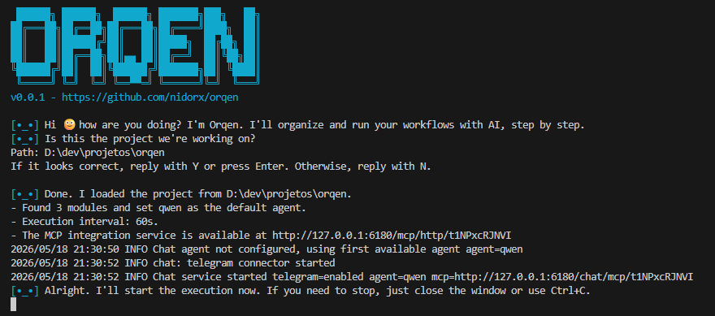

# Instalação

Orqen é distribuído como um **binário standalone** - sem dependências externas. Basta baixar e executar.

## Download (__VERSION__)

<div class="download-wrapper">
  <a class="download-card" href="https://github.com/nidorx/orqen/releases/download/__VERSION__/orqen-windows-amd64.exe">
    <div class="os">Microsoft Windows</div>
    <div class="arch">Windows 10 or later, Intel 64-bit processor</div>
    <div class="filename">orqen-windows-amd64.exe</div>
  </a>
  <a class="download-card" href="https://github.com/nidorx/orqen/releases/download/__VERSION__/orqen-linux-amd64">
    <div class="os">Linux</div>
    <div class="arch">Linux 3.2 or later, Intel 64-bit processor</div>
    <div class="filename">orqen-linux-amd64</div>
  </a>
  <a class="download-card" href="https://github.com/nidorx/orqen/releases/download/__VERSION__/orqen-darwin-arm64.pkg">
    <div class="os">Apple macOS (ARM64)</div>
    <div class="arch">macOS 12 or later, Apple 64-bit processor</div>
    <div class="filename">orqen-darwin-arm64.pkg</div>
  </a>
  <a class="download-card" href="https://github.com/nidorx/orqen/releases/download/__VERSION__/orqen-darwin-amd64.pkg">
    <div class="os">Apple macOS (X86-64)</div>
    <div class="arch">macOS 12 or later, Intel 64-bit processor</div>
    <div class="filename">orqen-darwin-amd64.pkg</div>
  </a>
</div>

Você encontra outras opções para download na [página de Releases do GitHub](https://github.com/nidorx/orqen/releases/tag/__VERSION__).

## Outras opções

### Windows

```powershell
# Download (PowerShell)
Invoke-WebRequest -Uri "https://github.com/nidorx/orqen/releases/download/__VERSION__/orqen-windows-amd64.exe" -OutFile "orqen.exe"

# Executar
.\orqen.exe
```

### Linux

```bash
# Download
curl -LO "https://github.com/nidorx/orqen/releases/download/__VERSION__/orqen-linux-amd64"

# Tornar executável e instalar
chmod +x orqen-linux-amd64
sudo mv orqen-linux-amd64 /usr/local/bin/orqen

# Executar
orqen
```

### macOS Apple Silicon

```bash
# Download
curl -LO "https://github.com/nidorx/orqen/releases/download/__VERSION__/orqen-darwin-arm64"

# Tornar executável e renomear
chmod +x orqen-darwin-arm64
mv orqen-darwin-arm64 orqen

# Executar
./orqen
```

### macOS Intel

```bash
# Download
curl -LO "https://github.com/nidorx/orqen/releases/download/__VERSION__/orqen-darwin-amd64"

# Tornar executável e renomear
chmod +x orqen-darwin-amd64
mv orqen-darwin-amd64 orqen

# Executar
./orqen
```

## Screenshot do terminal executando o Orqen



## Verificando a Instalação

Ao executar o Orqen pela primeira vez, você verá o banner ASCII e uma mensagem de boas-vindas:

```
Oi 🙂 tudo bem com você? Eu sou a Orqen. Vou organizar e executar seus fluxos de trabalho com AI, passo a passo.
Perfeito. Vou iniciar a execução agora. Se quiser interromper, é só fechar a janela ou usar Ctrl+C.
```

O CLI solicitará um diretório de projeto contendo `.orqen/orqen.yaml`.

## Pré-requisitos

**Nenhum.** O binário é completamente standalone.

- Não requer Go instalado
- Não requer Node.js
- Não requer banco de dados
- Não requer serviço externo

O único requisito é [ter um agente ACP compatível instalado (como Claude, Qwen Code, GitHub Copilot, etc.)](https://agentclientprotocol.com/get-started/agents) para executar os workflows.

## Portas

O Orqen utiliza portas locais para comunicação interna. Ele tenta automaticamente as seguintes portas (em ordem):

| Porta | Uso |
|-------|-----|
| 6180 | Porta principal |
| 6181-6318 | Portas alternativas |
| 7420-9094 | Portas fallback |

Se nenhuma dessas estiver disponível, o Orqen aloca uma porta livre automaticamente.

## Próximos passos

- [Conceitos](conceitos.md) - Entenda lanes, módulos e artefatos
- [Configuração](configuracao.md) - Configure seu primeiro workflow
- [Exemplos](exemplos.md) - Pipelines prontos para usar
