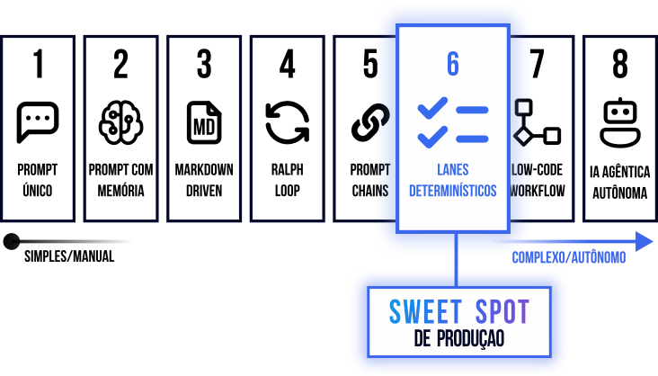

# Por que Orqen?

O Orqen fornece uma **camada de execução estruturada** que:

1. **Orquestra agentes de IA** através de fluxos definidos (lanes)
2. **Persiste estado** via design filesystem-first (tarefas, decisões, aprendizados), [Everything is a file](https://en.wikipedia.org/wiki/Everything_is_a_file)
3. **Suporta múltiplos projetos** com configurações independentes _*WIP, multi-modulos por hora_
4. **Funciona com qualquer agente ACP** (Qwen, Claude, custom)

## Comparação Direta

Ferramentas de IA atuais operam como **máquinas de prompt sem estado**. Você precisa:

- Iterar manualmente, mantendo contexto na cabeça
- Gerenciar decisões entre conversas separadas
- Reconstruir o contexto a cada nova sessão
- Sem rastreabilidade do que foi feito, quando e por quê

| | Ferramentas de IA Típicas | Orqen |
|---|---|---|
| **Interação** | Baseadas em prompt | Baseadas em estado |
| **Memória** | Sem estado | Memória persistente (filesystem) |
| **Execução** | Iteração manual | Loops autônomos com checkpoints |
| **Escopo** | Projeto único | Orquestração multi-projeto _*WIP, multi-modulos por hora_ |
| **Rastreabilidade** | Conversas isoladas | Artefatos versionáveis |
| **Controle** | Tudo na conversa humana | Lanes com gates de qualidade |

## Onde o Orqen se posiciona

Recentemente eu escrevi [um artigo no Linkedin](https://www.linkedin.com/pulse/8-arquiteturas-de-automacao-com-ia-alex-rodin-lbcyc) que fala sobre algumas arquiteturas de automação, o Orqen é uma ferramenta que se enquadra próximo à categoria de topo, trazendo as vantagens da automação mas sem as complexidades e riscos das soluções seguintes.  

**Lanes determinísticos com checkpoints humanos.**

- Estado visível a qualquer momento (basta olhar o filesystem)
- Checkpoints humanos em pontos de gate (revisão, aprovação)
- Modos de falha claros (FAIL artifacts, regras críticas)
- Auto-correção contida dentro de cada stage

## Para quem é

- **Desenvolvedores** que querem automação com supervisão humana
- **Equipes de conteúdo** que precisam de pipelines repetíveis (ideação → publicação)
- **Tech leads** que buscam rastreabilidade e auditoria de decisões
- **Qualquer pessoa** que executa processos repetitivos e quer estruturá-los com IA

## Próximos passos

- [Instalação](instalacao.md) - Instale e execute em minutos
- [Conceitos](conceitos.md) - Entenda lanes, módulos e artefatos
- [Exemplos](exemplos.md) - Pipelines prontos para usar
