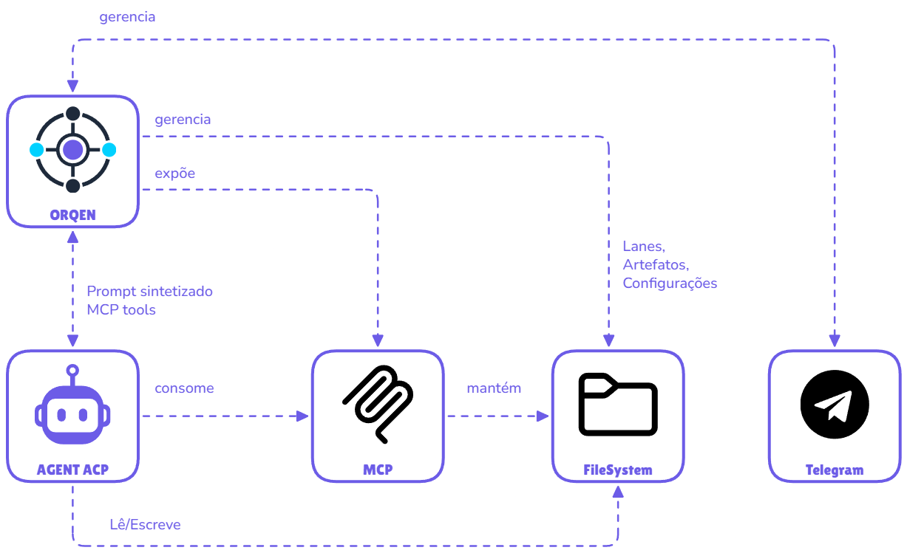

# Conceitos Fundamentais

## Visão Geral

Orqen é um **orquestrador de terminal** controlado por um único arquivo de configuração (`.orqen/orqen.yaml`). O motor escanea lanes em ordem de prioridade, invoca agentes ACP para executar trabalho e persiste tudo no filesystem.




## Lanes

Uma **lane** representa um estágio em um pipeline de trabalho (como colunas em um quadro Kanban).

```
INBOX → BACKLOG → DOING → REVIEW → DONE
```

Cada lane define:
- **Propósito** - O que acontece aqui (injetado no prompt do agente)
- **Comportamento do agente** - Passos sequenciais que o agente segue
- **Regras críticas** - Regras absolutas que nunca podem ser ignoradas
- **Artefatos** - Tipos de arquivos que o agente pode criar

### Exemplo de Lane

```yaml
lanes:
  - name: "doing"
    purpose: "Tarefa sendo implementada pelo agente"
    artifacts: ["SUMMARY", "FAIL"]
    agent_behavior:
      - "Lê a tarefa e o refinamento se disponível"
      - "Implementa conforme especificações"
      - "Cria o artefato SUMMARY ao concluir"
```

As lanes são automaticamente prefixadas com número sequencial no filesystem:
- `01_inbox/`
- `02_backlog/`
- `03_doing/`
- `04_review/`
- `05_done/`


Exemplo de pipeline Kanban mostrando o fluxo de um item de trabalho.

```
┌─────────┐    ┌──────────┐   ┌─────────┐   ┌──────────┐   ┌───────┐
│  INBOX  │──> │ BACKLOG  │──>│  DOING  │──>│  REVIEW  │──>│ DONE  │
│ (user)  │    │ (user)   │   │ (agent) │   │ (agent)  │   │(arch) │
└─────────┘    └──────────┘   └─────────┘   └──────────┘   └───────┘
```

- INBOX: _Ideias do usuário_
- BACKLOG: _Aguardando priorização_
- DOING: _Implementação em andamento_
- REVIEW: _Validação de qualidade_
- DONE: _Arquivado com sucesso_

**Estado** = diretórios no filesystem

### Agendamento de Lanes

Cada lane pode ter uma configuração de `schedule` que define janelas de execução. O motor verifica se a lane está elegível para execução com base na data e hora atuais.

```yaml
lanes:
  - name: "review"
    purpose: "Revisão automática noturna"
    schedule:
      frequency: daily
      time: "02:00"
```

Isso significa que a lane só será executada quando o relógio estiver próximo do horário configurado (com tolerância de 2 minutos). Útil para lanes que devem rodar apenas em horários específicos, como revisões noturnas, relatórios ou tarefas de manutenção.

Para detalhes completos de configuração, consulte a seção [Agendamento de Lanes](configuracao.md#agendamento-de-lanes) em Configuração.

## Módulos

Um **módulo** agrupa lanes relacionadas em um diretório dedicado. Um projeto pode ter múltiplos módulos.

### Exemplo de Módulo

```yaml
modules:
  - name: task
    dir: "tasks"
    lanes:
      - name: "inbox"
        purpose: "Ideias prontas para virar tarefas"
      - name: "doing"
        purpose: "Tarefa em implementação"
      - name: "review"
        purpose: "Implementação aguardando revisão"
```

## Artefatos

**Artefatos** são arquivos estruturados que o agente cria durante a execução. Eles seguem a convenção de nomenclatura: `{PREFIXO}-{SEQUÊNCIA}-{TIPO}.md`

Exemplos:

| Artefato | Descrição | Quando é criado |
|----------|-----------|-----------------|
| `TASK-0001-SUMMARY.md` | Resumo da implementação | Ao completar uma tarefa com sucesso |
| `TASK-0001-FAIL.md` | Registro de falha | Quando um blocker impede a execução |
| `TASK-0001-REFINEMENT.md` | Detalhamento técnico | Durante o refinamento da tarefa |
| `ADR-0001.md` | Architecture Decision Record | Quando uma decisão de arquitetura é documentada |

## Agent Client Protocol (ACP)

O [**ACP** é o protocolo](https://agentclientprotocol.com/get-started/introduction) que permite ao Orqen se comunicar com [qualquer agente de IA](https://agentclientprotocol.com/get-started/agents). O agente recebe prompts sintetizados e interage com o workflow via ferramentas MCP.

### Como funciona

1. Orqen escaneia lanes por trabalho disponível
2. Monta um prompt com: contexto + definição da lane + item de trabalho
3. Invoca o agente ACP via subprocesso
4. O agente usa ferramentas MCP para interagir com o workflow
5. O agente move itens entre lanes ao completar trabalho

### Ferramentas MCP disponíveis

| Ferramenta | Descrição |
|------------|-----------|
| `workitem` | Consulta o status do workflow |
| `workitem_create` | Cria um novo item de trabalho |
| `workitem_move` | Move um item entre lanes |
| `workitem_list` | Lista itens em uma lane |
| outras | Detalhes em https://github.com/nidorx/orqen/tree/main/pkg/mcp | 

## Fluxo de Execução Completo

1. **Carrega**: Lê orqen.yaml
2. **Escaneia**: Verifica lanes por trabalho
3. **Invoca**: Agente recebe prompt
4. **Executa**: Agente age no item
5. **Repete**: Ciclo continua (sleep interval)

Cada invocação do agente é **stateless** - todo contexto vem do filesystem. Não há estado oculto.

## Próximos passos

- [Configuração](configuracao.md) - Configure seu primeiro workflow
- [Agentes](agentes.md) - Configure Qwen, Claude ou Copilot
- [Exemplos](exemplos.md) - Pipelines prontos para usar